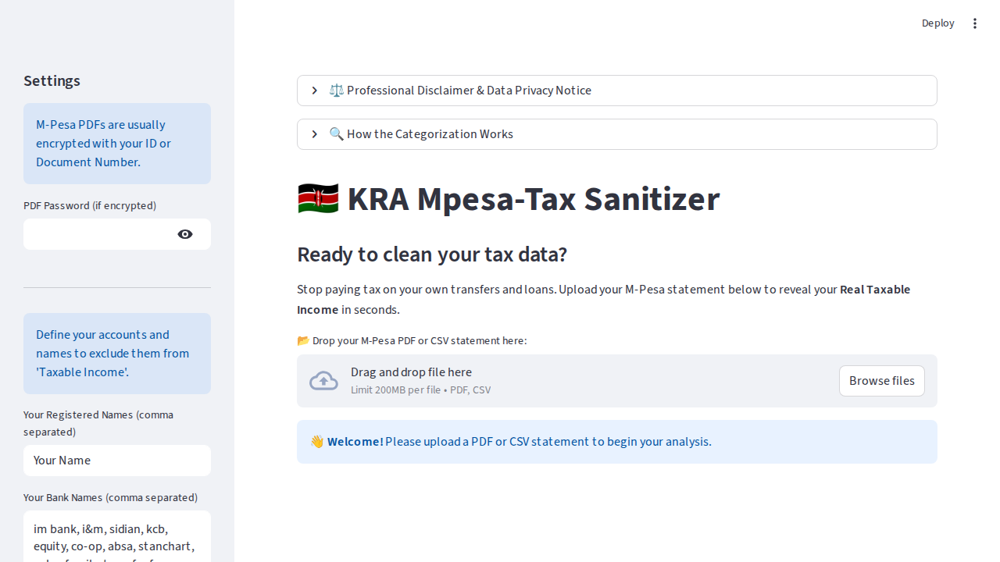

# 🇰🇪 KRA Mpesa-Tax Sanitizer

[](https://mpesatax.streamlit.app/)
[](https://opensource.org/licenses/MIT)



**Transform your M-Pesa statements from a "Boring Tax Table" into a powerful "M-Pesa Tax Dashboard."** 🚀

---

## 🚀 Key Features

- **📂 Multi-Format Support**: Automatically extracts transaction data from both **M-Pesa PDF statements** and **CSV reports**.
- **📊 M-Pesa vs. Noise Analysis**: Advanced metrics dashboard showing "Gross Money In" versus "Net Taxable Base" using the 'Rule of Thumb' logic.
- **📈 Interactive Visualizations**: Dynamic **Plotly** pie charts and monthly trend bar charts for source and trend analysis.
- **✅ Interactive iTax Checklist**: A final preparation checklist to ensure data accuracy before filing on `itax.kra.go.ke`.
- **🎓 Educational Insights**: Built-in guides explaining Kenyan tax rules (e.g., the 288k annual tax-free threshold and why loans aren't income).
- **🌓 Theme Support**: Fully compatible with both **Light and Dark modes** through Streamlit's native theme engine.
- **🔒 Local-First Privacy**: Your PDF passwords and financial data never leave your browser. Processing happens entirely in your local session.

---

## 🛠️ How it Works (Categorization Logic)

<details>
<summary><b>🔍 View Advanced Categorization Methodology</b></summary>

The "Sanitizer" uses a heuristic engine to classify inflows based on description keywords and transaction direction:

1.  **Money-In Identification**: Identifies income indicators like `Received from`, `Transfer from bank`, and `Loan received`.
2.  **Asset Transfer (Bank)**: Matches known Kenyan bank keywords (KCB, Equity, Sidian, I&M, etc.) to exclude your own bank-to-mobile movements.
3.  **Loan/Credit (Non-Taxable)**: Detects lenders like M-Shwari, Fuliza, Tala, and the Hustler Fund. These are categorized as liabilities, not income.
4.  **Asset Transfer (Mobile)**: Uses your registered names and phone number suffixes to identify self-transfers (moving money between your own lines).
5.  **Exempt (Gambling Winnings)**: Identifies platforms like Sportpesa or Betika where withholding tax (20%) is already deducted at the source.
6.  **Taxable Income**: The remaining "Clean" revenue that represents your actual business or freelance earnings.

</details>

---

## 🏁 Getting Started

### Prerequisites
- Python 3.8+
- [Streamlit](https://streamlit.io/)

### Installation

1.  **Clone the Repository**
    ```bash
    git clone https://github.com/tilelvis/hustlampesa.git
    cd hustlampesa
    ```

2.  **Install Dependencies**
    ```bash
    pip install -r requirements.txt
    ```

3.  **Launch the Dashboard**
    ```bash
    streamlit run app.py
    ```

---

## ⚖️ Professional Disclaimer & Data Privacy
- **No Storage**: This application **does not store** your passwords or statement data. Once the session is closed, the data is wiped.
- **Accuracy**: While tuned for Kenyan M-Pesa formats, this is an AI-assisted categorization tool. You are legally responsible for the accuracy of your KRA returns.
- **Not Financial Advice**: For analytical and educational purposes only.

---

## 👨‍💻 Support & Engagement

If this tool helped you organize your taxes, please consider:
- ⭐ **Starring** the repository on [GitHub](https://github.com/tilelvis/hustlampesa)
- 🤝 **Engaging** with the project through issues or pull requests.

**Developed by Elvis Tile.**
*Licensed under the MIT License.*
